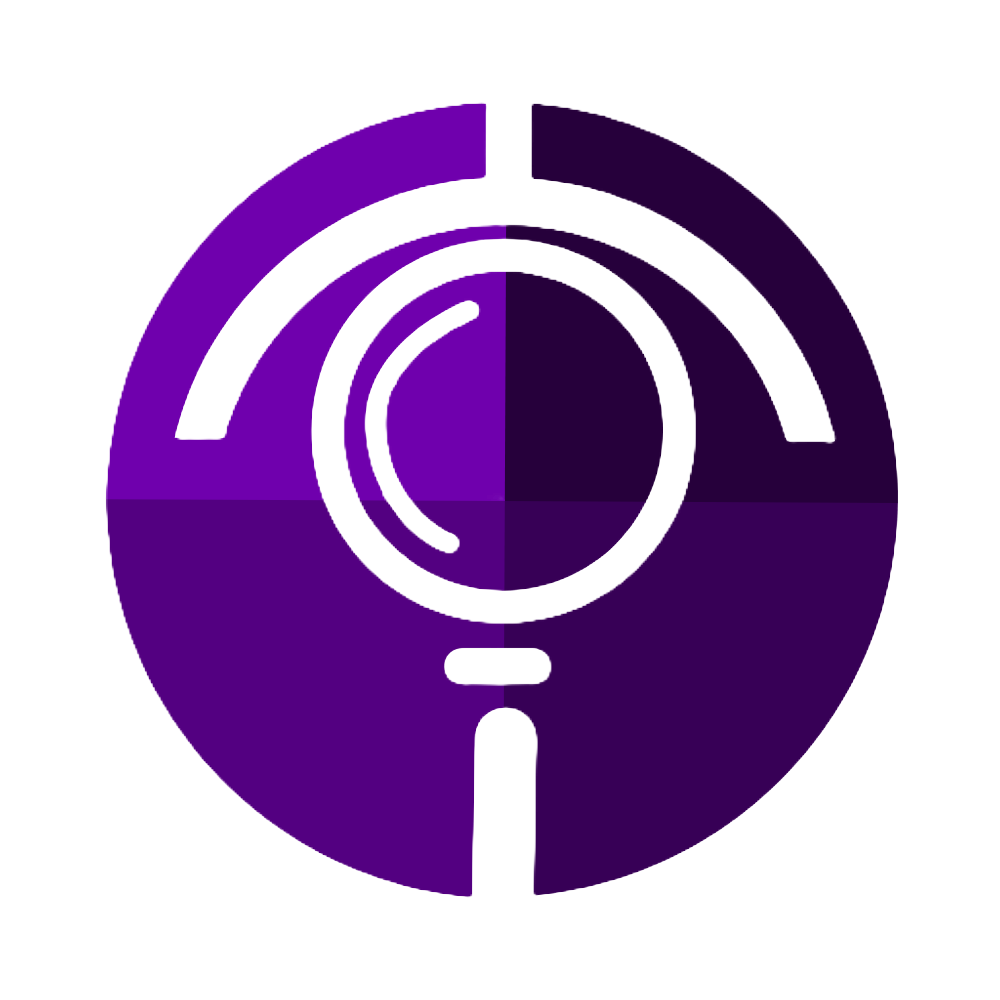

<div align="center">



# 🛡️ TruthScope

### The Omniscient AI Fact-Checker & Media Forensics Engine

[](https://python.org)
[](https://fastapi.tiangolo.com)
[](https://nextjs.org)
[](https://typescriptlang.org)
[](https://developer.chrome.com/docs/extensions)
[](https://ai.google.dev)
[](https://truthscopee.vercel.app)
[](LICENSE)

**[Live Demo](https://truthscopee.vercel.app)** · **[Report Bug](https://github.com/devxaves/GFG-Finals/issues)** · **[Request Feature](https://github.com/devxaves/GFG-Finals/issues)**

---

*TruthScope is a deeply integrated, full-stack AI platform and browser extension designed to instantly combat misinformation as you browse. Combining high-speed fact verification, state-of-the-art deepfake detection, and bias profiling — it provides a transparent "truth layer" over the modern internet.*

</div>

---

## 📋 Table of Contents

- [Overview](#-overview)
- [Key Features](#-key-features)
- [System Architecture](#-system-architecture)
- [Project Structure](#-project-structure)
- [Tech Stack](#-tech-stack)
- [External APIs & Services](#-external-apis--services)
- [Backend Pipeline (DAG)](#-backend-pipeline-dag)
- [Chrome Extension Architecture](#-chrome-extension-architecture)
- [Database & State Management](#-database--state-management)
- [Getting Started](#-getting-started)
- [Environment Variables](#-environment-variables)
- [API Reference](#-api-reference)
- [Contributing](#-contributing)

---

## 🌐 Overview

TruthScope was built for the **GeeksForGeeks Hackathon Finals** as a production-grade AI platform for combating online misinformation in real time. The core thesis: instead of asking users to manually verify claims, TruthScope embeds an AI forensics layer *directly into the browser*, intercepting content as it loads and returning a verdict before the user has finished reading.

The system operates on three tracks simultaneously:

- **Textual Fact-Checking** — Decomposes article text into atomic claims and cross-references them against live authoritative sources via LLM-guided search.
- **Visual Forensics** — Scans images on the current page for AI-generation artifacts, flagging synthetic or deepfake media with a confidence score.
- **Sentiment & Bias Profiling** — Analyzes the rhetorical framing of articles to surface psychological manipulation and partisan slant.

---

## ✨ Key Features

| Feature | Description |
|---|---|
| **Real-Time Fact Verification** | Atomic claim decomposition → Tavily live search → Gemini 2.5 Flash scoring pipeline |
| **Deepfake & AI Media Detection** | Hugging Face `umm-maybe/AI-image-detector` forensic scan on all in-page images |
| **Intelligent DOM Highlighting** | Extension anchors directly onto HTML text nodes — highlights misinformation in-situ without breaking page layout |
| **Sentiment & Bias Profiling** | LLM-assigned bias baseline + sentiment score surfaced per article |
| **Related News Feed** | Chrome sidebar renders verified evidence with AI reasoning chains as a live "Related News" panel |
| **Google OAuth 2.0** | Identity-validated request pipeline from extension → backend |
| **Stateless Architecture** | Zero persistent storage — every request is independently verified, no data retained |

---

## 🏗️ System Architecture

```
┌─────────────────────────────────────────────────────────────────────────┐
│                         BROWSER (Chromium)                              │
│                                                                         │
│  ┌───────────────────┐   DOM / Text   ┌──────────────────────────────┐  │
│  │   Content Script  │ ─────────────► │   Background Service Worker  │  │
│  │  (Page Scraper)   │                │   (Message Bus + Auth Gate)  │  │
│  └───────────────────┘                └──────────────┬───────────────┘  │
│           ▲                                          │                  │
│    Highlights                               Google OAuth 2.0            │
│    injected                                          │                  │
│           │                                          ▼                  │
│  ┌────────┴──────────┐                  ┌────────────────────────────┐  │
│  │    Sidebar UI     │ ◄──── Results ── │       REST API Call        │  │
│  │  (React/HTML)     │                  │      (HTTP POST /verify)   │  │
│  └───────────────────┘                  └────────────────────────────┘  │
└──────────────────────────────────────────────────────────────────────── ┘
                                               │
                                    ┌──────────▼───────────┐
                                    │   FastAPI Backend     │
                                    │   Python + Uvicorn    │
                                    │   Port 8000           │
                                    │                       │
                                    │  ┌─────────────────┐  │
                                    │  │  DAG Pipeline   │  │
                                    │  │                 │  │
                                    │  │ 1. Claim        │  │
                                    │  │    Extractor    │  │
                                    │  │       ↓         │  │
                                    │  │ 2. Search       │  │
                                    │  │    Agent        │  │
                                    │  │       ↓         │  │
                                    │  │ 3. Verification │  │
                                    │  │    Engine       │  │
                                    │  │       ↓         │  │
                                    │  │ 4. Media        │  │
                                    │  │    Analyzer     │  │
                                    │  └─────────────────┘  │
                                    └──────────┬────────────┘
                          ┌───────────┬────────┴──────────────┐
                          ▼           ▼                        ▼
              ┌───────────────┐ ┌──────────────────┐ ┌──────────────────────┐
              │  Tavily API   │ │  Google Gemini   │ │  Hugging Face API    │
              │ (Web Search)  │ │  2.5 Flash (LLM) │ │  AI-image-detector   │
              └───────────────┘ └──────────────────┘ └──────────────────────┘
```

### Deployment Topology

```
truthscopee.vercel.app           localhost:8000               chrome://extensions
      (Next.js)                   (FastAPI)                  (Browser Extension)
        │                             │                              │
   Vercel CDN              Uvicorn + Python 3.11+           Chrome MV3 Runtime
   Edge Network              (local / self-hosted)          Content + BG Workers
```

---

## 📁 Project Structure

```
GFG-Finals/
│
├── 📂 extension/
│   └── 📂 frontend/                   # Chrome Extension (MV3)
│       ├── manifest.json              # Extension manifest (MV3)
│       ├── content.js                 # Content Script — DOM extraction & highlight injection
│       ├── background.js              # Service Worker — message bus, OAuth, API relay
│       ├── sidebar.html               # Sidebar panel HTML shell
│       ├── sidebar.js                 # Sidebar logic — renders claims, verdicts, news feed
│       ├── sidebar.css                # Sidebar styles
│       ├── popup.html                 # Extension popup (quick controls)
│       ├── popup.js / popup.css       # Popup logic & styles
│       ├── icon16.png                 # Extension icon (16×16)
│       ├── icon48.png                 # Extension icon (48×48)
│       └── icon128.png                # Extension icon (128×128)
│
├── 📂 landing/
│   ├── 📂 fact-check-api/             # Python FastAPI Backend
│   │   ├── main.py                    # FastAPI app entry point, route definitions
│   │   ├── pipeline.py                # DAG pipeline orchestrator
│   │   ├── claim_extractor.py         # Claim decomposition module
│   │   ├── search_agent.py            # Tavily search integration
│   │   ├── verifier.py                # Gemini LLM verification engine
│   │   ├── media_analyzer.py          # Hugging Face image forensics
│   │   ├── requirements.txt           # Python dependencies
│   │   └── .env                       # API keys (not committed)
│   │
│   ├── 📂 app/                        # Next.js App Router
│   │   ├── layout.tsx                 # Root layout
│   │   ├── page.tsx                   # Landing page
│   │   └── globals.css                # Global styles
│   ├── 📂 components/                 # Reusable React components
│   ├── 📂 public/                     # Static assets
│   ├── next.config.js                 # Next.js configuration
│   ├── tailwind.config.ts             # Tailwind CSS configuration
│   ├── tsconfig.json                  # TypeScript configuration
│   └── package.json                   # Node.js dependencies
│
├── overview.md                        # High-level project notes
├── prompt.md                          # LLM prompt templates
├── cleanup.py                         # Utility / cleanup script
├── .gitignore
└── README.md                          # ← This file
```

---

## 🛠️ Tech Stack

### Frontend / Web App

| Technology | Version | Purpose |
|---|---|---|
| **Next.js** | 14+ | React framework, App Router, SSR/SSG for landing page |
| **TypeScript** | 5.x | Type-safe development across web app |
| **Tailwind CSS** | 3.x | Utility-first CSS framework |
| **React** | 18+ | Component model for UI |
| **Vercel** | — | Deployment, CDN, edge functions |

### Chrome Extension

| Technology | Version | Purpose |
|---|---|---|
| **Chrome Extensions Manifest V3** | MV3 | Extension runtime (modern, secure) |
| **TypeScript / JavaScript** | ES2022+ | Extension logic |
| **Content Scripts** | — | DOM traversal, claim extraction, highlight injection |
| **Service Workers** | — | Background message bus, API relay, auth gate |
| **Google OAuth 2.0** | — | Identity validation for extension requests |
| **Chrome Side Panel API** | — | Persistent sidebar UI alongside page content |

### Backend

| Technology | Version | Purpose |
|---|---|---|
| **Python** | 3.11+ | Core backend language |
| **FastAPI** | 0.110+ | High-performance async REST API framework |
| **Uvicorn** | 0.29+ | ASGI server — production-grade HTTP server |
| **Pydantic** | 2.x | Request/response schema validation |
| **httpx / aiohttp** | — | Async HTTP client for external API calls |
| **python-dotenv** | — | Environment variable management |

### Language Breakdown

```
TypeScript   ████████████████░░░░░░░░   62.3%
JavaScript   ██████░░░░░░░░░░░░░░░░░░   19.2%
Python       ████░░░░░░░░░░░░░░░░░░░░   11.4%
HTML         ██░░░░░░░░░░░░░░░░░░░░░░    5.9%
CSS          ░░░░░░░░░░░░░░░░░░░░░░░░    1.2%
```

---

## 🔌 External APIs & Services

### 1. Google Gemini 2.5 Flash

```
Provider:   Google AI / Vertex AI
Model:      gemini-2.5-flash
Role:       Primary LLM evaluator
```

Used for three distinct tasks in the pipeline:

- **Claim Decomposition** — Takes raw paragraph text, returns a structured list of independently verifiable atomic claims.
- **Evidence Evaluation** — Given a claim + search results, scores confidence as `SUPPORTED | CONTRADICTED | UNVERIFIABLE | MISLEADING` with a reasoning chain.
- **Bias & Sentiment Analysis** — Assigns left/center/right bias score and emotional framing index to full article text.

Gemini 2.5 Flash was selected for its **sub-second inference latency** and strong instruction-following on structured output tasks.

---

### 2. Tavily Search API

```
Provider:   Tavily AI
Role:       Authoritative web search for AI agents
```

Tavily replaces standard scraping by providing:

- **Bypass of bot-blocking** on major news sources and academic platforms.
- **Pre-ranked results** tuned for factual, authoritative content (Reuters, AP, academic journals, government sites).
- **Clean text extraction** — returns parsed article text, not raw HTML, ready for LLM consumption.

Each atomic claim is independently sent to Tavily to retrieve 3–5 supporting or contradicting sources before being passed to Gemini.

---

### 3. Hugging Face Inference API — `umm-maybe/AI-image-detector`

```
Provider:   Hugging Face
Model:      umm-maybe/AI-image-detector
Task:       Image classification (real vs. AI-generated)
```

Images encountered on the page are:

1. Extracted from the DOM by the Content Script.
2. Passed as binary blobs through the Background Service Worker.
3. Proxied through the FastAPI backend to the Hugging Face Inference endpoint.
4. Returned with a `{ label: "REAL"|"FAKE", score: 0.0–1.0 }` confidence result.

The proxy is necessary because the extension cannot make direct cross-origin requests to Hugging Face from a content script context.

---

### 4. Google OAuth 2.0

```
Provider:   Google Identity Services
Role:       Request authentication
```

The Chrome extension uses the `chrome.identity` API with Google OAuth 2.0 to:

- Validate the identity of the user before forwarding page content to the backend.
- Attach a signed token to all API requests, preventing unauthenticated abuse of the inference endpoints.

---

## ⚙️ Backend Pipeline (DAG)

The FastAPI backend implements a **Directed Acyclic Graph (DAG)** pipeline — each stage completes before feeding its output into the next. The pipeline is designed to be parallelized at the claim level (multiple claims processed concurrently).

```
Input Text
    │
    ▼
┌──────────────────────────────────────────────┐
│  Stage 1: Claim Extractor                    │
│                                              │
│  Model: Gemini 2.5 Flash                     │
│  Input: Raw article paragraph(s)             │
│  Output: [ "Claim A", "Claim B", "Claim C" ] │
│  Method: Structured JSON prompt → parse list │
└────────────────────┬─────────────────────────┘
                     │  (per claim, concurrent)
                     ▼
┌──────────────────────────────────────────────┐
│  Stage 2: Search Agent                       │
│                                              │
│  API: Tavily Search                          │
│  Input: Single atomic claim string           │
│  Output: [ { title, url, content } × 3–5 ]  │
│  Strategy: Bypasses scrape blocks, returns   │
│            authoritative sources only        │
└────────────────────┬─────────────────────────┘
                     │
                     ▼
┌──────────────────────────────────────────────┐
│  Stage 3: Verification Engine                │
│                                              │
│  Model: Gemini 2.5 Flash                     │
│  Input: (claim, evidence_docs[])             │
│  Output: {                                   │
│    verdict: SUPPORTED|CONTRADICTED|          │
│             MISLEADING|UNVERIFIABLE,         │
│    confidence: 0.0–1.0,                      │
│    reasoning: "...",                         │
│    sources: [ url, ... ]                     │
│  }                                           │
└────────────────────┬─────────────────────────┘
                     │  (parallel, independent)
                     ▼
┌──────────────────────────────────────────────┐
│  Stage 4: Media Analyzer                     │
│                                              │
│  API: Hugging Face Inference                 │
│  Input: Image binary (from page DOM)         │
│  Output: { label: REAL|FAKE, score: float }  │
│  Note: Runs in parallel to text pipeline     │
└──────────────────────────────────────────────┘
                     │
                     ▼
             Aggregated Response
          (JSON → Extension Sidebar)
```

### API Endpoint Summary

| Method | Endpoint | Description |
|---|---|---|
| `POST` | `/verify` | Submit page text for full fact-check pipeline |
| `POST` | `/analyze-image` | Submit image URL/binary for deepfake detection |
| `POST` | `/bias` | Submit article text for sentiment/bias scoring |
| `GET` | `/health` | Health check — returns `{ status: "ok" }` |

---

## 🔧 Chrome Extension Architecture

The extension is built on **Chrome Manifest V3 (MV3)**, the current and most secure extension platform.

```
┌─────────────────────────────────────────────────────┐
│                 Chrome Extension (MV3)               │
│                                                     │
│  content.js          background.js      sidebar.js  │
│  (Content Script)    (Service Worker)  (Side Panel) │
│                                                     │
│  Runs in:            Runs in:           Runs in:    │
│  Page's isolat-      Extension          Side panel  │
│  ed world           background          context     │
│                                                     │
│  Can:                Can:               Can:        │
│  - Read DOM          - Make ext.        - Render     │
│  - Inject CSS        API calls          results UI  │
│  - Highlight         - Manage OAuth     - Show feed  │
│    text nodes        - Forward to       - Display   │
│  - Extract           FastAPI            reasoning   │
│    content                                          │
│                                                     │
│  Cannot:             Cannot:                        │
│  - Call ext. APIs    - Access DOM                   │
│  - Access other      directly                       │
│    origins directly                                 │
└─────────────────────────────────────────────────────┘
```

### Message Flow

```
User visits page
       │
       ▼
Content Script activates
  └─► Extracts visible text from DOM
  └─► Detects image src attributes
       │
       ▼ chrome.runtime.sendMessage()
Background Service Worker receives
  └─► Validates Google OAuth token
  └─► POSTs to FastAPI /verify endpoint
  └─► POSTs to FastAPI /analyze-image endpoint
       │
       ▼ Receives JSON response
  └─► Sends results to Sidebar via chrome.runtime.sendMessage()
       │
       ▼
Sidebar UI renders:
  └─► Claim cards with verdict badges
  └─► Confidence scores
  └─► Source citations (Related News)
  └─► AI reasoning chain
  └─► Image forensics results

Background Service Worker also:
  └─► Sends highlight coords back to Content Script
       │
       ▼
Content Script injects highlight spans
  onto exact DOM text nodes
```

---

## 💾 Database & State Management

**TruthScope is fully stateless — there is no database.**

This is a deliberate architectural decision:

- Every request is independently processed end-to-end.
- No user data, browsing history, or article content is ever persisted.
- API keys are stored as server-side environment variables only (never sent to the client).
- Results are ephemeral — they live only in the sidebar for the duration of the tab session.

This approach ensures **zero data retention risk**, eliminates infrastructure complexity, and is appropriate for the hackathon scope.

For a production extension, persistent storage could be added via:

- **Supabase / PostgreSQL** — for user accounts and claim history
- **Redis** — for caching repeated claim lookups (same URL checked by multiple users)
- **Pinecone / Weaviate** — for vector-similarity search on previously verified claims

---

## 🚀 Getting Started

### Prerequisites

- Python 3.11+
- Node.js 18+
- A Chromium-based browser (Chrome, Edge, Brave)
- API keys for Gemini, Tavily, and Hugging Face

### 1. Clone the Repository

```bash
git clone https://github.com/devxaves/GFG-Finals.git
cd GFG-Finals
```

### 2. Start the FastAPI Backend

```bash
cd landing/fact-check-api

# Create and activate virtual environment
python -m venv .venv
.venv\Scripts\activate          # Windows
# source .venv/bin/activate     # macOS / Linux

# Install dependencies
pip install -r requirements.txt

# Create environment file (see Environment Variables section)
cp .env.example .env
# → Edit .env with your API keys

# Start the server
uvicorn main:app --reload --port 8000
```

The API will be available at `http://localhost:8000`. Swagger docs at `http://localhost:8000/docs`.

### 3. Start the Next.js Web App

```bash
cd landing

npm install
npm run dev
```

The landing page will be available at `http://localhost:3000`.

### 4. Load the Chrome Extension

1. Open Chrome and navigate to `chrome://extensions/`
2. Enable **Developer mode** (toggle in top-right corner)
3. Click **Load unpacked**
4. Select the `extension/frontend/` directory
5. Pin TruthScope from the Extensions toolbar

> **Note:** Ensure the backend is running on port 8000 before activating the extension on a page.

---

## 🔑 Environment Variables

Create a `.env` file in `landing/fact-check-api/`:

```env
# Google Gemini API
GEMINI_API_KEY=your_gemini_api_key_here

# Tavily Search API
TAVILY_API_KEY=your_tavily_api_key_here

# Hugging Face Inference API
HUGGINGFACE_API_KEY=your_huggingface_token_here

# Google OAuth (for extension auth validation)
GOOGLE_CLIENT_ID=your_google_client_id_here
```

| Variable | Where to Get |
|---|---|
| `GEMINI_API_KEY` | [Google AI Studio](https://aistudio.google.com/app/apikey) |
| `TAVILY_API_KEY` | [Tavily Dashboard](https://tavily.com) |
| `HUGGINGFACE_API_KEY` | [Hugging Face Settings](https://huggingface.co/settings/tokens) |
| `GOOGLE_CLIENT_ID` | [Google Cloud Console](https://console.cloud.google.com/) |

---

## 📡 API Reference

### `POST /verify`

Submit article text for full fact-checking pipeline.

**Request Body:**
```json
{
  "text": "The Eiffel Tower was built in 1887 and stands 450 meters tall.",
  "url": "https://example.com/article"
}
```

**Response:**
```json
{
  "claims": [
    {
      "claim": "The Eiffel Tower was built in 1887",
      "verdict": "CONTRADICTED",
      "confidence": 0.97,
      "reasoning": "Construction began in 1887 but the tower was completed in 1889.",
      "sources": [
        { "title": "Eiffel Tower - Wikipedia", "url": "https://..." }
      ]
    },
    {
      "claim": "The Eiffel Tower stands 450 meters tall",
      "verdict": "CONTRADICTED",
      "confidence": 0.99,
      "reasoning": "The Eiffel Tower stands 330 meters tall including its antenna.",
      "sources": [...]
    }
  ],
  "bias_score": 0.1,
  "sentiment": "neutral",
  "processing_time_ms": 1842
}
```

---

### `POST /analyze-image`

Submit an image for AI/deepfake detection.

**Request Body:**
```json
{
  "image_url": "https://example.com/image.jpg"
}
```

**Response:**
```json
{
  "label": "FAKE",
  "confidence": 0.91,
  "model": "umm-maybe/AI-image-detector"
}
```

---

### `GET /health`

```json
{ "status": "ok", "version": "1.0.0" }
```

---

## 🤝 Contributing

Contributions are welcome. Please follow this workflow:

1. Fork the repository
2. Create a feature branch: `git checkout -b feature/your-feature-name`
3. Commit your changes: `git commit -m 'feat: add some feature'`
4. Push to the branch: `git push origin feature/your-feature-name`
5. Open a Pull Request

Please ensure your PR includes a clear description of what was changed and why.

---

## 👥 Team

Built with ❤️ for the **GeeksForGeeks Hackathon Finals** by the `devxaves` team.

---

## 📄 License

This project is licensed under the MIT License. See [LICENSE](LICENSE) for details.

---

<div align="center">

**[truthscopee.vercel.app](https://truthscopee.vercel.app)** · Built for GFG Finals · Powered by Gemini, Tavily & Hugging Face

</div>
